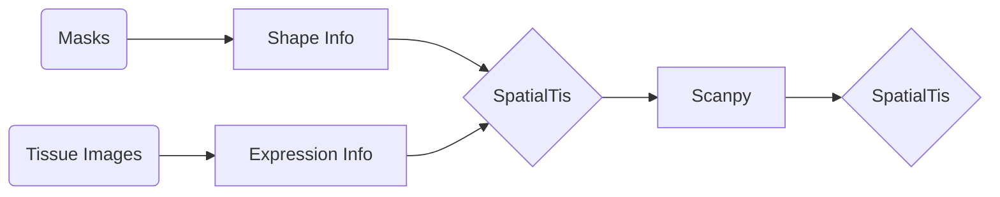
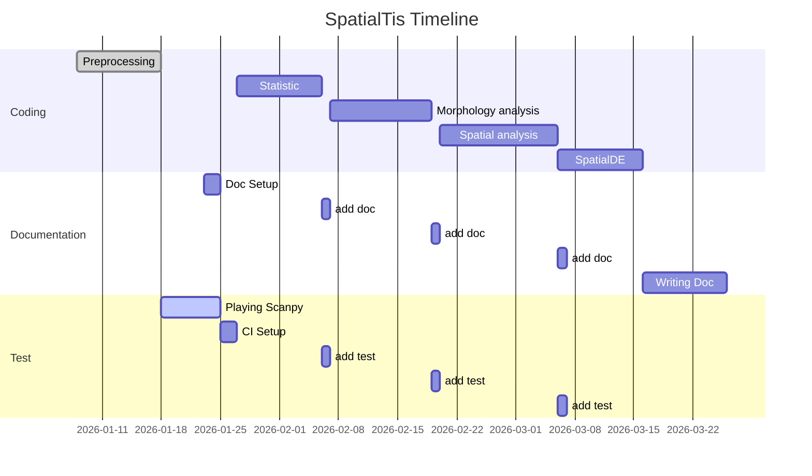

# SpatialTis
spatialtis is a toolkit for analysis of multiplexed tissue imaging data written in python. Applied to any multiplexed tissue data with single cell solution. eg. Imaging Mass Cytometry and Multiplex Ion Beam Imaging.

spatialtis uses [`annData`](https://icb-anndata.readthedocs-hosted.com/en/stable/#) object as input, to integrated with popular single cell analysis library [`Scanpy`](https://scanpy.readthedocs.io/en/latest/index.html) . Preprocessing module of spatialtis allow you to transfrom your data into `annData` objects, please prepare your multiplexed image data and cell mask for each ROI in seperated folders.


### Requirements

- numpy
- pandas
- scipy
- scikit-image
- shapely (Geometry library)
- anndata
- diffxpy (DE analysis for scRNA-seq)
- ray (multiprocessing library, not available for windows)
- matplotlib
- seaborn
- bokeh (For interactive visualization)


## Preprocessing

### Recommended preprocessing pipeline

spatialtis will extract shape info from mask image and single cell expression info from multiplexed data. You can then use scanpy for cell filtering and identify cell type, other single cell analysis can also be done in scanpy. Afterwards, you can conduct other analysis in spatialtis.





### Convert all your ROIs to anndata

Suppose this is the directory that we are going to process, the top level folder is 'Data', and the we seperate the folders based on patients, next level by sample number, and the lowest level is each ROI from different slide.

```shell
Data
├── Patient1
│   ├── Sample1
│   │   ├── ROI1
│   │   ├── ROI2
│   ├──Sample2
│   │   ├── ROI1
│   │   ├── ROI2
│   └──Sample3
│       ├── ROI1
│       └── ROI2
├── Patient2
├── Patient3
└── ...
```

You only need to specific the entry level, and then name the condition name as you like.

```python
from spatialtis import read_all_ROIs

entry_folder = './data'
conditions = ['Patients','Sample','ROI']

data = read_all_ROIs(entry_folder, conditions)
```

If not configuration are provided, spatialtis will detect the channels info automatically, but it doesn't know the corresponding marker to each channels. You can config it in two way.

```python
# directly config
channels = ['Dy161','Dy162','Dy164','Er166','Er167','Er168']
markers = ['CD20','CD99','NFkB','GnzB','Ki67']
data = data.config(channels=channels, markers=markers)

# through a file
data = data.config_file('./metadata.csv', channel_col='channel', marker_col='marker')
```

Now you can generate the anndata object, if you work on linux and macOS, you can try to set `mp=True` to enable parallellism. The default is to take convex hull of cell shape to minimize the representing points of a cell, the underlying assumption is that most of the cell shape is round. If your cell has antennaes like a neuron cell, you can set `polygonize='concave'`, but this will dramatically increase the processing time. It's recommended to set as 'convex', since there is almost no difference in downstream analysis, only advantage is the visualization of ROI are more close to real.

```python
adata = data.to_anndata(mp=True)
```


## Statistic

The API design of analysis part is similar to scanpy.

#### Cell Components

- Statistic of portion of cell types


#### Cell Density


#### Morphology

- Size, diameter, eccentricity, etc...


## Spatial

If you want to use number of neighbors for each cell in identifing cell types. You can use `Neighbors` for help.

```python
n = Neighbors(data, ['Patients','Sample','ROI'])
# find neighbors for each cell by scaling the cell to 1.2 fold
n.find_neighbors(scale=1.2)
# export to data.obs, default key: 'neighbors_count'
n.neighbors_count()
```


If you want to conduct spatial analysis after identifying cell types, you need to tell `Neighbors` the cell types.

```python
n = Neighbors(data, ['Patients','Sample','ROI'], type_col='cell_type')
n.find_neighbors(scale=1.2)
n.export_neighbors()

# if you have your neighbor computed and saved
# just read it, not need to compute again
n = Neighbors(data, ['Patients','Sample','ROI'], type_col='cell_type')
n.read_neighbors()
```


Once a `Neighbors` instance with neighbors info computed and ready, you can start spatial analysis

```python
# run neighborhood analysis
neighborhood_analysis(n, resample=500, p_value=0.05)
# run spatial enrichment analysis
spatial_enrichment_analysis(n, reample=500)
# run communites detection
communites(n)
```


#### Find neighbors

Find neighbors for each cells


#### Neighborhood Analysis

An Python implementation of histocat's neighborhood analysis


#### Spatial Distribution

Ref: https://www.zoology.ubc.ca/~krebs/downloads/krebs_chapter_06_2017.pdf

There are three options to measure the distribution of cells in spatialtis

In the result table: 0 (Blank), 1 (Random), 2 (Regular), 3 (Clumped)

|                         | Random | Regular | Clumped |
| ----------------------- | ------ | ------- | ------- |
| Index of dipersion: ID | ID = 1 | ID < 1  | ID > 1  |
| Moristia: I             | I = 1 | I < 1 | I > 1 |
| Clark and Evans: R      | R = 1  | R < 1   | R > 1   |


- Index of dispersion

Index of dispersion $$ID = \frac{s^2}{\overline{x}}$$

Significant test: $\chi^2$ test

> Encyclopedia of Ecology, Chapter: Spatial Distribution, Publisher: Oxford: Elsevier, Editors: S E Jørgensen, B D Fath, pp.3304-3310 [[link](https://www.researchgate.net/publication/234136591_Spatial_distribution_patterns)]


- Morisita’s index of dispersion

$I_d = n[\frac{\sum x^2 - \sum x}{(\sum x)^2 - \sum x}]$

$\sum x$ Sum of the quadrat counts: $\sum x = x_1+x_2+x_3+...$

$\sum x^2$ sum of quadrat counts squared: $\sum x = x_1^2+x_2^2+x_3^2+...$

Significant test: $\chi^2$ test

$\chi^2 = I_d(\sum x - 1)+n-\sum x$  ($df = n-1$)


- Clark and Evans aggregation index

Index of aggregation: $R = \frac{\overline{r}_A}{\overline{r}_E}$

$\overline{r}_A$ Mean distance to nearest neighbor: $\overline{r}_A = \frac{\sum r_i}{n}$

>  $r_i$: Distance to nearest neighbor for individual $i$ (we use euclidean distance)
>
> $n$: number of individuals

$\overline{r}_E$ Expected distance to nearest neighbor: $\overline{r}_E = \frac{1}{2\sqrt{\rho}}$

> $\rho$ density of individuals: $\rho = \frac{n}{\text{area size}}$


Significant test: z-score

$z = \frac{\overline{r}_A - \overline{r}_E}{S_r}$

> $S_r$ Standard error of the expected distance to nearest neighbor: $S_r = \frac{0.26136}{\sqrt{n\rho}}$


#### Spatial heterogeneity

Qualitify the heterogenity of a tissue.

Implementation: Calculation via scipy.stats.entropy

Shannon entropy

$H(X) = -\sum P_i log_2(P_i)$

Kullback–Leibler divergences between P and Q

$D = \sum P_i log_2(\frac{P_i}{Q_i})$

Example: SCP paper in nature


#### Hotspot Analysis

Getis–Ord hotspot analysis

z score for a region $i$

$z_i=\sum_{j=1}^n W_{i,j} C_j - \frac{\overline{C}\sum_{j=1}^n W_{i,j}}{SU}$

$S=\sqrt{\frac{\sum_{j=1}^n C_j^2}{n} - (\overline{c})^2}$

$U=\sqrt{\frac{[n\sum_{j=1}^n W_{i,j}^2 - (\sum_{j=1}^n W_{i,j})^2]}{n-1}}$

$$W_{i,j} = \left\{\begin{equation}\begin{array}{lr}
             \text{1 if j is a neighbor of i}\\
             \text{0 if j is not a neighbor of i}
             \end{array}
\end{equation}\right.$$

$n$ total number of grid regions

$C_j$ Cell count for region $j$

$\overline{C}$ mean of cell count in all region

Example: https://www.nature.com/articles/modpathol201537


#### Spatial communities detection (Network Partition)

In each ROI, cells' spatial network are computed based on finding neighbors. Leiden alogirithm (Extension of louvain algorithm) are used to detect communities.


#### Network Centralities [[link](https://www.ncbi.nlm.nih.gov/pmc/articles/PMC3101653/#__sec11title)]

Possible Usage:

**Closeness Centrality** indicates important nodes that can communicate quickly with other nodes

If a type of cell can exert more influence to others


#### Clustering of cell community

eg. How well immune cell function in these small region?

Detection of micro-events (events among few cells)

Cuzick–Edwards test

https://www.biomedware.com/files/documentation/clusterseer/C&E/CE_Statistic.htm

https://github.com/vtraag/leidenalg


### Differential experssion analysis with spatial factor

- A protein expression is affected when there are some other cells nearby
  - add statistic approach to filter combination


## Timeline



## Docs

- All plotting function will return a `bokeh.plotting.figure.Figure` object, user can change the figure with bokeh's setting options.
- The number of colors in a palette is limited, it will reuse colors when the provided colors are not sufficient. You can provide multiple palette at the same time, `palette = ['Set3','Spectral']` or `palette = ['#A35E47','#F596AA']` (The name of the palettes are usually capitalized, if 'cividis' not work, try 'Cividis'.)
- For heatmap palettes: Cividis, Gray, Inferno, Magma, Viridis


## Q&A

- spatialtis.spatial and PySAL library?

Actually part of spatial module is based on pointpat in PySAL


Something to share

Most of the coding of spatialtis are finished during the coronavirus breakout in China, I had to stay at home to help the country control the transmission of virus. Gladly it work well.

