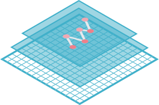

<p align="center">

<p/>


# SpatialTis
[](https://spatialtis.readthedocs.io/en/latest/?badge=latest)


> Currently, I'm moving some of the implementation to [spatialtis_core](https://github.com/Mr-Milk/SpatialTis-core). 
> 
> This will be available in the next release, long with lots of new features and performance improvement.
> 
> Planning features includes (No gurantee): 
> - Support for visium data, identify spatial domain, spatial variable genes
> - Spatial autocorrelation: Moran's I, Geary's C
> - cell-cell communications pathways
> - Quadratic stats supports hexagon: Used in Morisita index and Getis-ord analysis
> - Serializable geometry info on disk
> - Neighbors search support radius/knn/raidus+knn
> - Super fast concave hull algorithms to parse points into shape.

SpatialTis is a high-performance spatial analysis toolkit for single-cell multiplexed tissue data using [`AnnData`](https://icb-anndata.readthedocs-hosted.com/en/stable/#) object as input with **parallel processing** support.

**Documentation**: [](https://spatialtis.readthedocs.io/en/latest/)

[Quick Start](https://spatialtis.readthedocs.io/en/latest/tutorial/1-basic_usage.html)

## Installation

### pypi

Install the basics

```shell
pip install spatialtis
```

For the full features

```shell
pip install 'spatialtis[all]'
```

Install the current development version

```shell
pip install git+https://github.com/Mr-Milk/SpatialTis.git
```

## SpatialTis modules

- **Preprocessing**
- **Basic analysis**
    - Cell components
    - Cell density
    - Cell morphology
    - Cell co-occurrence
- **Spatial analysis**
    - Find cell neighbors
    - Spatial distribution
    - Spatial heterogeneity
    - Hotspot detection
    - Cell-cell interaction
    - Spatial co-expression
    - Spatial community detection
    - Neighbor dependent markers
