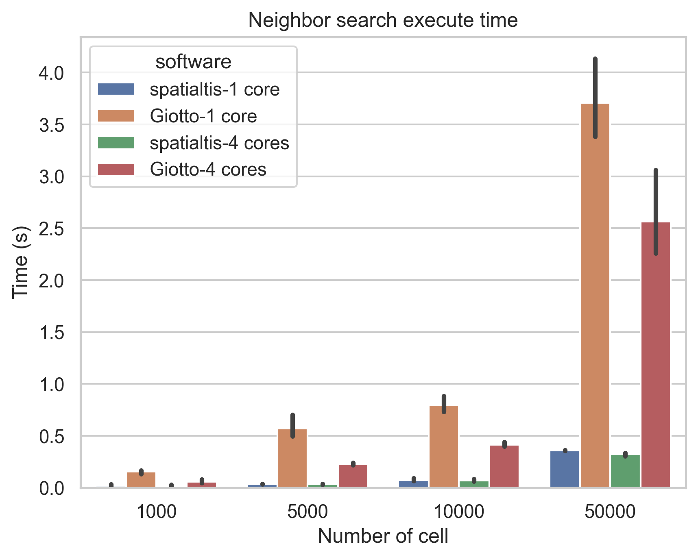

# Benchmark

This folder contains scripts to compare the running time of Neighbor search and
cell-cell interaction between SpatialTis and Giotto.

Latest result:

<p align="center">
    
    
</p>


## Build Docker Image

### SpatialTis

```shell
docker build -f time-spatialtis.Dockerfile
```

### Giotto
Please download the Giotto Docker image from their website

http://spatialgiotto.rc.fas.harvard.edu/giotto.install.docker.html

```shell
docker build -f time-giotto.Dockerfile
```

## Run the scripts

Please noted that on MacOS you need readjust the RAM resource to run Giotto,
For SpatialTis the default 2G RAM resource is enough, For Giotto, please allocate
at least 20G RAM.

First generate some fake data

```shell
python fake_data.py
```

Let's time spatialtis, first run using 1 core.

```shell
docker run -it --rm \
 --mount type=bind,source="$PWD",target=/usr/src/app \
 --cpus 1 \
 --memory 2g \
 time_spatialtis bash
```
Inside the docker shell, make sure the spatialtis version is > 0.2.0

```shell
pip install -e .
```

To run the scripts

```shell
cd benchmark
python time_spatialtis.py
mv spatialtis_cci_time.csv spatialtis_cci_time_1core.csv
mv spatialtis_nns_time.csv spatialtis_nns_time_1core.csv
```

And the we use 4 cores.

```shell
docker run -it --rm \
 --mount type=bind,source="$PWD",target=/usr/src/app \
 --cpus 4 \
 --memory 2g \
 time_spatialtis bash
```

Inside Docker shell

```shell
cd benchmark
python time_spatialtis.py
mv spatialtis_cci_time.csv spatialtis_cci_time_4core.csv
mv spatialtis_nns_time.csv spatialtis_nns_time_4core.csv
```

The same for Giotto, notice that you need 20G RAM to run Giotto

```shell
docker run -it --rm \
 --mount type=bind,source="$PWD",target=/usr/src/app \
 --cpus 1 \
 --memory 20g \
 time_giotto bash

cd benchmark
Rscript time_giotto.r
mv giotto_nns_time.csv giotto_nns_time_1core.csv
mv giotto_cci_time.csv giotto_cci_time_1core.csv

docker run -it --rm \
 --mount type=bind,source="$PWD",target=/usr/src/app \
 --cpus 4 \
 --memory 20g \
 time_giotto bash

cd benchmark
Rscript time_giotto.r
mv giotto_nns_time.csv giotto_nns_time_4core.csv
mv giotto_cci_time.csv giotto_cci_time_4core.csv
```


### Plotting

```shell
python plot.py
```