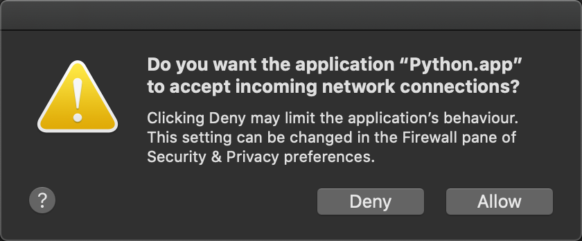

Q&A
====

What is SpatialTis?
#######################

SpatialTis is a spatial analysis toolkit for single-cell multiplexed tissue data.

How parallel processing works?
#################################

Following functions in spatialtis can have parallel processing supported by `Ray <https://docs.ray.io/en/latest/>`_, use argument :code:`mp=True` to enable.

- :class:`spatialtis.read_ROIs`
- :func:`spatialtis.spatial_distribution`
- :func:`spatialtis.spatial_heterogeneity`
- :func:`spatialtis.hotspot`

These are implemented in rust, it will automatically run in parallel, supported by `rayon <https://github.com/rayon-rs/rayon>`_.

- :class:`spatialtis.find_neighbors`
- :class:`spatialtis.neighborhood_analysis`
- :class:`spatialtis.spatial_enrichment_analysis`

These functions have internal support.

- :class:`spatialtis.NCDMarkers`
- :class:`spatialtis.NMDMarkers`

As for the rest, there is no need to implement parallel for now.

Could you provide a conda installation?
########################################

Current pip is already great enough to handle dependencies installation for you.
A conda recipe require every dependencies on conda channel, however, many of the dependencies of SptialTis are not
avialable in conda.

Do you want the application "Python.app" to accept the incoming network connection?
#####################################################################################

If there are lots of these windows pop up on Mac, it's cause by *Ray*.
If you find it annoying, the simplest solution is to turn off your firework (with safety risk)
or add it into the firewall white list.
Another solution from this `stackoverflow answer <https://stackoverflow.com/a/59186900>`_ might also be helpful.
