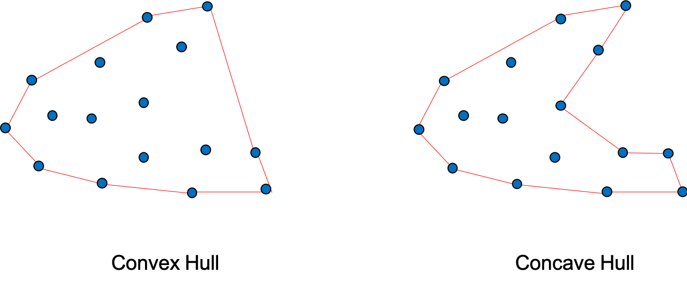
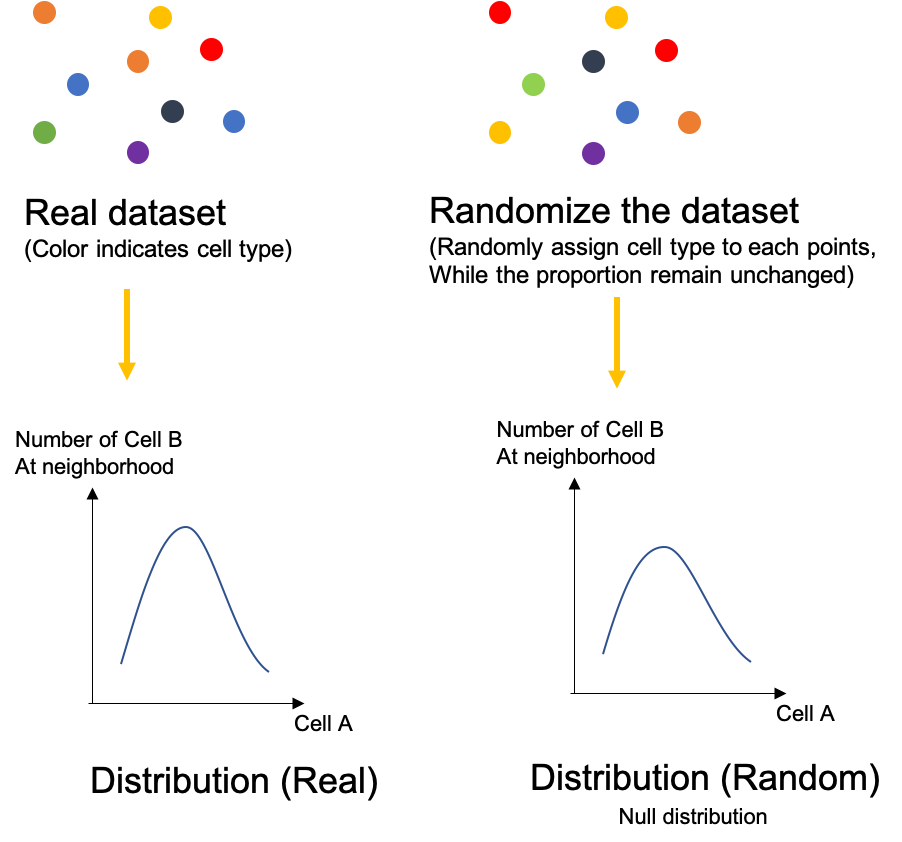
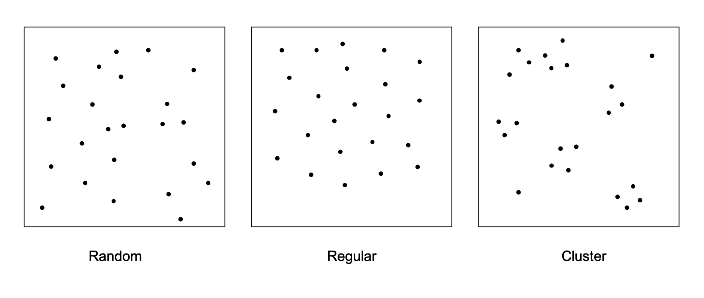
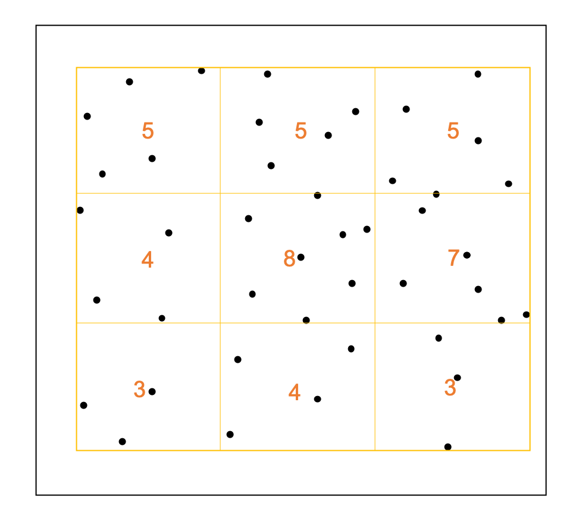
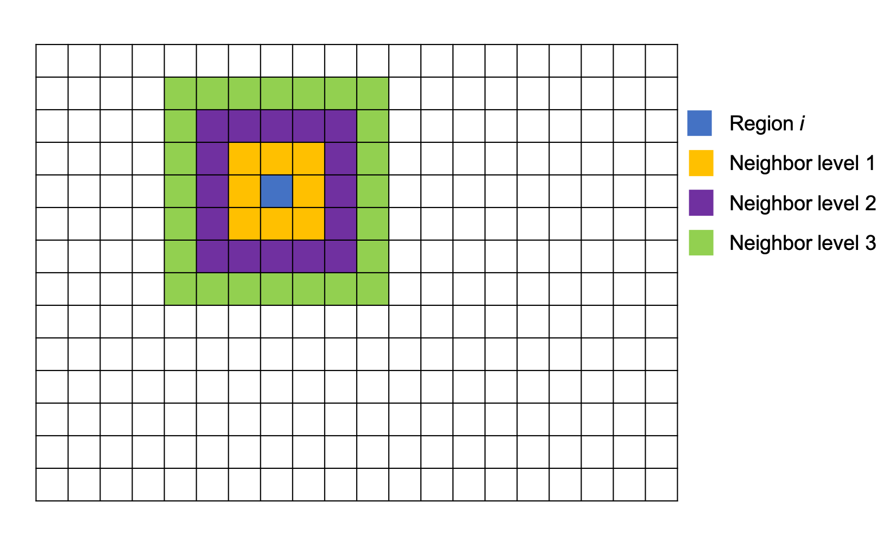

Implementation
===============

This section will introduce the idea of all the spatial analysis methods and algorithms use in spatialtis.

Hopefully the following explanation can help you understand it as easily as possible.

Determine cell shape
--------------------

There are two way to determine the shape of a cell, "convex hull" or "concave hull". The "concave hull" is slower and need an extra
parameter, an alpha value. This will influence the `cell_shape` but no other geometry information. Although the shape
look more authentic using concave hull, spatialtis use `alphashape <https://github.com/bellockk/alphashape>`_ which is pure-python
implementation so it's super slow. We highly recommend using "convex hull" which is the default setting.

Cell co-occurrence
------------------

The occurrence or absence of a cell type in a ROI (Region of interest) is determined by a user-defined threshold value,
for example if we set the threshold at 50, the cell type is determined as occurrence if it's counts exceed 50 otherwise
it's absence. Afterwards, if two types of cell are both determine as occurrence, one-way :math:`\chi^2` test are
conducted to determine the significance, if one or both are absence would be determined as non co-occurrence.

Find cell neighbors
-------------------

Depends on the resolution of different spatial single-cell technology, some resolved single cell as point, another with
subcellular resolution can resolve single cell in 2D-shape.
For each ROI, every cell will be stored in a spatial index tree structure allowing for fast neighbor search.

For point data, `KD-tree <https://en.wikipedia.org/wiki/K-d_tree>`_ is used and constructed using
scipy's `cKDtree <https://docs.scipy.org/doc/scipy/reference/generated/scipy.spatial.cKDTree.html>`_.

For 2D-shape data, `R-tree <https://en.wikipedia.org/wiki/R-tree>`_ is used and constructed using
shapely's `STRtree <https://shapely.readthedocs.io/en/latest/manual.html#str-packed-r-tree>`_.

Profiling of cell-cell interaction
-----------------------------------

To profile the interaction between cells, spatialtis used permutation test. First purposed in `histocat <https://www.nature.com/articles/nmeth.4391>`_.

Let's simplify the situation here, consider only the interaction between cell type A and B. We can draw a distribution
from the real dataset of the number of Cell B at the neighborhood of Cell A. After that, we can randomize the dataset,
randomly reassign cell type to different cell while keep the number of each cell type unchanged. Therefore we can draw
another distribution. This randomization process can perform multiple times (usually 1000 times) to draw a null distribution.

Now let's compare the difference between two distributions. If the distribution from the real has less difference to the
distribution from the random dataset, it means the real distribution might just be random whereas the relationship between
Cell A and B is likely to be random. But if there is a significant differences, the relationship between Cell A and B could
likely to be association (If many Cell B around Cell A) or avoidance (If few Cell B around Cell A).

In neighborhood analysis, a pseudo-`p` value is calculated as follow:

.. math::
    P_{association} = \frac{\text{Numbers of }(\overline{perm}\geq\overline{real})}{\text{Number of resample} + 1}

    P_{avoidance} = \frac{\text{Numbers of }(\overline{perm}\leq\overline{real})}{\text{Number of resample} + 1}

Or using z-score:

.. math::
    z = \frac{real - \overline{perm}}{\sigma}

This analysis is implemented with rust for a better performance.
See `neighborhood_analysis <https://github.com/Mr-Milk/neighborhood_analysis>`_

Profiling of marker co-expression
----------------------------------

User defines the positive / negative of a marker in a cell, same bootstrap method is conducted as above.
A z-score is calculated for each combination of markers.

Spatial distribution
---------------------

There are three point distribution patterns in general, random, regular and cluster. Random means the point pattern follows the poisson process,
the regular means evenly distributed and cluster means the points tend to aggregate. (Cells are represented by their centroid)

To determine the cell distribution patterns in each ROI, spatialtis provided three methods.

     - Index of Dispersion (ID)
     - Morisita’s index of dispersion (MID)
     - Clark and Evans aggregation index (CE)

+--------------------------------------+--------+---------+---------+
|                                      | Random | Regular | Clumped |
+======================================+========+=========+=========+
| Index of dispersion: ID              | ID = 1 | ID < 1  | ID > 1  |
+--------------------------------------+--------+---------+---------+
| Morisita’s index of dispersion: I    | I = 1  |  I < 1  |  I > 1  |
+--------------------------------------+--------+---------+---------+
| Clark and Evans aggregation index: R | R = 1  |  R < 1  |  R > 1  |
+--------------------------------------+--------+---------+---------+

Index of dispersion
###################

.. figure:: ../src/index_of_dispersion.png
    :width: 50%
    :align: center
    :figclass: align-center

    Sampling process, the orange circle is the sampling windows, the number is the count of points

First we store all the point in a ROI in KD tree. A random sample window with diameter `r` is generated,
the count of points in this window is `x`, a number of counts are generated after sampling many times. The null
hypothesis is that the points are randomly distributed. :math:`s^2` is the variance of all samples,
:math:`\overline{x}` is the average of all samples. Index of dispersion is calculated
as follow:

.. math:: ID = \frac{s^2}{\overline{x}}

Morisita’s index of dispersion
##############################

This is a quadratic statistic method, user need to define how to rasterize the ROI.

    In this example, the ROI is divided into :math:`3\times3` grids, the number is the count of points

Morisita’s index of dispersion is calculated as follow:

.. math:: I_d = n[\frac{\sum x^2 - \sum x}{(\sum x)^2 - \sum x}]

:math:`\sum x` sum of the quadrat counts :math:`\sum x = x_1+x_2+x_3+...`

:math:`\sum x^2` sum of quadrat counts squared :math:`\sum x = x_1^2+x_2^2+x_3^2+...`

:math:`\chi^2 = I_d(\sum x - 1)+n-\sum x`  (:math:`df = n-1`)

Clark and Evans aggregation index
##################################

This method evaluate the distribution pattern base on distance between points. The points are stored in KD tree
at the first place.

Index of aggregation is calculated as follow:

.. math::
    R = \frac{\overline{r}_A}{\overline{r}_E}

:math:`\overline{r}_A` Mean distance to nearest neighbor: :math:`\overline{r}_A = \frac{\sum r_i}{n}`

:math:`r_i` Distance to nearest neighbor for individual :math:`i` (here we use euclidean distance)

:math:`n` number of individuals

:math:`\overline{r}_E` Expected distance to nearest neighbor: :math:`\overline{r}_E = \frac{1}{2\sqrt{\rho}}`

:math:`\rho` density of individuals: :math:`\rho = \frac{n}{\text{area size}}`

:math:`z = \frac{\overline{r}_A - \overline{r}_E}{S_r}`

:math:`S_r` Standard error of the expected distance to nearest neighbor: :math:`S_r = \frac{0.26136}{\sqrt{n\rho}}`

Spatial heterogeneity
----------------------

In spatialtis, three entropy methods have been implemented to quantify the heterogeneity in a ROI.
Shannon entropy doesn't consider the spatial information. The Leibovici entropy and Altieri entropy consider
spatial factor to evaluate entropy in a system. See `spatialentropy <https://github.com/Mr-Milk/SpatialEntropy>`_.

Shannon entropy
###############

.. math::
    H(X) = -\sum P_i log_2(P_i)

To compare the difference within a group (eg. different samples from same tumor),
Kullback–Leibler divergences for each sample within the group are computed, smaller value indicates less difference within group.

.. math::
    D = \sum P_i log_2(\frac{P_i}{Q_i})

Leibovici entropy
###################

Leibovici entropy is based on the shannon entropy. A new variable :math:`Z` is introduced.

:math:`Z` is defined as co-occurrences across the space. For example, we have :math:`I` types of cells.
The combination of any two type of cells is :math:`(x_i, x_{i'})`,
the number of all combinations is denoted as :math:`R`.

If order is preserved, :math:`R = P_I^2 = I^2`;

If the combinations are unordered, :math:`R = C_I^2= (I^2+I)/2`.

At a user defined distance :math:`d`, only co-occurrences with the distance :math:`d` will take into consideration.

The Leibovici entropy is defined as:

.. math::
    H(Z|d) = \sum_{r=1}^{I^m}{p(z_r|d)}log(\frac{1}{p(z_r|d)})

Altieri entropy
#################

Altieri entropy introduce another new vairable :math:`W`. :math:`W_k` represents a series of sample window, i.e.
:math:`[0,2][2,4][4,10],[10,...]` while :math:`k=1,...,K`.

The purpose of this entropy is to decompose the spatial entropy into **Spatial mutual information** :math:`MI(Z,W)`
and **Spatial residual entropy** :math:`H(Z)_W`.

The Altieri entropy is defined as:

.. math::
    H(Z)=\sum_{r=1}^Rp(z_r)log(\frac{1}{p(z_r)})=MI(Z,W)+H(Z)_W

The Spatial residue entropy is defined as:

.. math::
    H(Z)_W = \sum_{k=1}^Kp(w_k)H(Z|w_k)

.. math::
    H(Z|w_k) = \sum_{r=1}^Rp(z_r|w_k)log(\frac{1}{p(z_r|w_k)})

The Spatial mutual information is defined as:

.. math::
    MI(Z,W)=\sum_{k=1}^Kp(w_k)PI(Z|w_k)

.. math::
    PI(Z|w_k)=\sum_{r=1}^Rp(z_r|w_k)log(\frac{p(z_r|w_k)}{p(z_r)})

Hotspot detection
------------------

Hotspot detection is used to find the cells that form clumps. Here we use
Getis–Ord hotspot analysis. First we rasterize the ROI into grids, for each small
square, we will compare it to its neighbor cells. User can define the level of neighbors
to search.

z score for a region :math:`i`:

.. math::
    z_i=\sum_{j=1}^n W_{i,j} C_j - \frac{\overline{C}\sum_{j=1}^n W_{i,j}}{SU}

.. math::
    S=\sqrt{\frac{\sum_{j=1}^n C_j^2}{n} - (\overline{c})^2}

.. math::
    U=\sqrt{\frac{[n\sum_{j=1}^n W_{i,j}^2 - (\sum_{j=1}^n W_{i,j})^2]}{n-1}}

.. math::
    W_{i,j} = \left\{\begin{equation}\begin{array}{lr}
                 \text{1 if j is a neighbor of i}\\
                 \text{0 if j is not a neighbor of i}
                 \end{array}
    \end{equation}\right.

:math:`n` total number of grid regions

:math:`C_j` Cell count for region j

:math:`\overline{C}` mean of cell count in all region

`A more illustrative example <https://www.nature.com/articles/modpathol201537>`_

Communities detection
----------------------

This is used to find communities in a ROI.
The neighbors relationships are convert to graph, each cell is a node, two nodes are connected if
they are neighbors, edge weight is represented by distance. Using leidenalg algorithm, we can detect
the communities within a ROI.

Marker influences on neighbor cells/markers
-------------------------------------------

The word *marker* can refer to gene/transcript/protein/metabolite... depends on your own data.

Random forest regressor estimator is constructed to find the cells/markers that explain more of the
interest markers using gini score.

