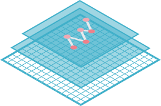

======================================
Welcome to SpatialTis's documentation!
======================================

|doc| |ci| |coverage| |pypi| |license|

.. |doc| image:: https://readthedocs.org/projects/spatialtis/badge/?version=latest&style=flat-square
.. |ci| image:: https://flat.badgen.net/github/status/Mr-Milk/SpatialTis?icon=github&label=CI
.. |coverage| image:: https://flat.badgen.net/codecov/c/github/Mr-Milk/SpatialTis
.. |license| image:: https://flat.badgen.net/github/license/Mr-Milk/SpatialTis
.. |pypi| image:: https://flat.badgen.net/pypi/v/spatialtis?color=blue

SpatialTis is an ultra-fast spatial analysis toolkit for large-scale spatial single-cell data.

- ✔️ Spatial Transcriptome (Non single-cell)
- ✔️ Spatial Proteome (Single-cell)
- 🦀 Core algorithms implements in Rust
- 🚀 Parallel processing support

🔋 **Highlighted spatial analysis**

- Cell neighbors search (KD-Tree/R-Tree/Delaunay)
- Cell-Cell Interaction
- Marker spatial co-expression
- Spatial variable genes (current support: SOMDE)
- GCNG: Inferring ligand-receptor using graph convolution network
- Identify neighbor dependent markers

📦 **Other analysis**

- Spatial distribution
- Hotspot detection
- Spatial auto-correlation
- Spatial heterogeneity

For a quick view of what it's does, check our the tutorial part.

.. toctree::
   :maxdepth: 2

   usage/index

.. toctree::
   :maxdepth: 2

   api

.. toctree::
   :maxdepth: 2

   examples/index

.. toctree::
   :maxdepth: 2

   about/index

