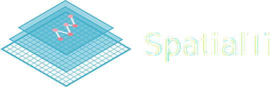

# Logo Design

## Elements

Three layers:

- Upper layer:
  - Transparent 50%
  - Border 3pt
  - Statistic graph, dots and lines
- Middle layer:
  - Transparent 50%
  - Border 3pt
- Lower layer:
  - Grid 1pt
  - Border 3pt
  - Background white

## Colors

Main color: **#3fb0ca** | Dot colors: **#ed8992** **#f0b1b6** | Linker: **#f2f4f7**

   

